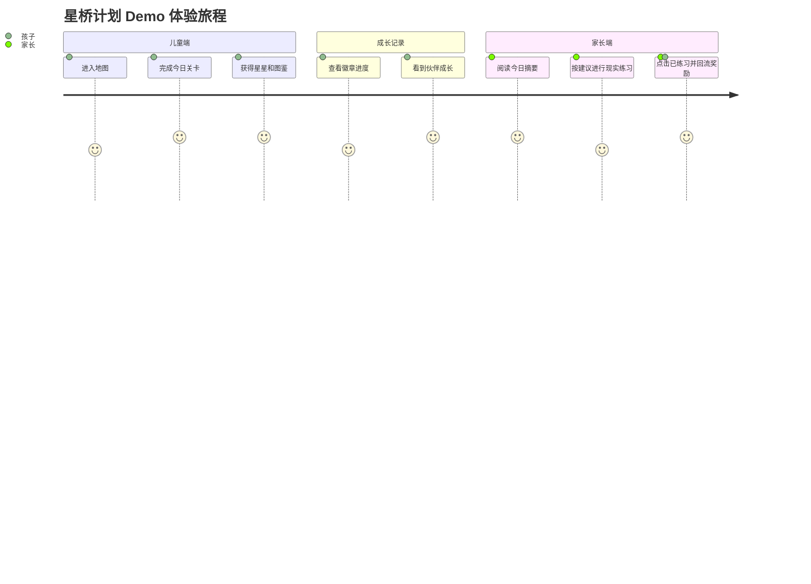

# 🌉 StarBridge · 星桥计划

**面向孤独症儿童的表达成长游戏 —— 让一句「我想要水」不再难以说出口**


## 💫 为什么做这个

人们常把孤独症儿童称为 **「来自星星的孩子」**。这个名字很美,但在美好的称呼之外,他们和他们的家庭面对的,往往是漫长、具体而日常的现实。

对一些孩子来说,普通人轻易说出口的一句话 —— "我要喝水"、"我不喜欢"、"请帮帮我"、"我可以一起玩吗" —— 可能需要很长时间学习。这些话看起来简单,却关系到一个孩子能不能表达需求、能不能减少崩溃、能不能进入一段关系。

> **星桥计划**想做的事很小:用游戏让孩子先在安全的环境里练表达,再让家长把同样的练习带回真实生活。我们不替代任何治疗师、不替代任何陪伴,我们只是想做那座桥。


## 我们想解决的不是一道题，而是一句话

对很多孩子来说，“我要喝水”“我不喜欢”“请帮帮我”“我可以一起玩吗”这些话并不简单。

它们看起来只是短短一句，却常常连接着更大的事情：

| 一句话 | 背后的能力 |
|---|---|
| 我要饼干 | 表达需求 |
| 我有点难过 | 识别情绪 |
| 请帮帮我 | 主动求助 |
| 早上好 | 进入关系 |
| 我可以一起玩吗 | 发起社交 |

星桥计划希望把这些句子拆成孩子可以理解、可以练习、可以反复尝试的小步骤。孩子在游戏里先获得经验，家长再把同样的练习带回真实生活。

---

## 🔁 星桥计划的完整闭环

星桥不是另一个儿童益智游戏。它是一条把游戏成长**真正迁移到现实生活**的链路:

```text
   ┌────────────────────┐         ┌────────────────────┐
   │   👶 儿童端游戏    │  ───→   │   ⭐ 通关奖励       │
   │  句子 / 情绪 / 礼貌 │         │  星星 · 图鉴 · 徽章 │
   └────────────────────┘         └─────────┬──────────┘
              ▲                              │
              │                              ▼
   ┌──────────┴─────────┐         ┌────────────────────┐
   │   🦌 伙伴回流成长  │ ◀───    │   🏆 成就页展示    │
   │  星光小鹿额外经验  │         │   今日成长可视化    │
   └────────────────────┘         └─────────┬──────────┘
              ▲                              │
              │                              ▼
   ┌──────────┴─────────┐         ┌────────────────────┐
   │   ✅ 家长打卡反馈   │ ◀───    │   👨‍👩‍👧 家长端建议   │
   │   "已练习"        │         │ AI 生成现实陪练方案 │
   └────────────────────┘         └────────────────────┘
```

**孩子在游戏中学会表达 → 游戏记录成长 → 家长知道今天该怎么练 → 现实练习回流游戏。** 这条链路,就是星桥的全部。

换句话说：

孩子在游戏中学会表达，游戏记录这份成长；家长知道今天可以怎么陪练，现实里的练习再回到儿童端，变成看得见的鼓励。


## 一个孩子的一天，可能这样经过星桥

早上，孩子打开游戏世界，看见熟悉的岛屿和星光小鹿。


今天的推荐任务是“句子积木岛”。孩子不用抢时间，也不会被催促。屏幕上出现人物、动作和物品，孩子点击词块，一点点拼出“我想要水”。


完成后，孩子获得一颗表达星和一张图鉴卡。成就页把今天的努力留下来，不用一句抽象的“你很棒”，而是告诉孩子：你刚刚完成了一次具体的表达。


晚上，家长打开家长端，不需要猜孩子今天练了什么。系统会把游戏里的表现整理成一段现实练习建议，比如在零食时间给出两个清晰选项，等待孩子表达“我要饼干”，再及时回应和复述。


当家长点击“已练习”，星光小鹿会获得额外成长。游戏不再只是游戏，它开始和真实生活发生关系。

## 已开放的练习场景

当前 Demo 已围绕几类高频表达能力展开。每个场景都尽量避免压力、惩罚和突然刺激，让孩子在稳定的节奏里练习。

### 句子积木岛：把想法拼成一句完整的话

孩子通过点击词块，练习从“想要”到“我想要水”这样的完整表达。  
它关注的是需求表达、拒绝表达和求助前的基础句式。


### 情绪消消乐湖：认识情绪，也理解情绪

这里的“消消乐”不是追求速度的游戏，而是温和的匹配练习。孩子可以把表情、情绪词和生活情境慢慢连接起来。


### 问候岛：从一句友好的话开始

孩子根据场景选择合适的问候、道歉或回应。它练习的不是机械背诵，而是在一个具体情境里找到更合适的表达方式。


### 求助山谷：困难出现时，可以找谁、怎么说

求助不是软弱，也不是失败。对孩子来说，知道什么时候可以求助，知道可以向谁求助，本身就是重要的安全能力。


## 星光小鹿：不是裁判，而是陪伴者

星光小鹿不会给孩子打分，也不会突然批评。它更像一个稳定的伙伴：

- 孩子完成练习时，它记录成长。
- 孩子需要倾诉时，它在聊天页里慢慢回应。
- 家长完成现实练习后，它也会获得成长反馈。


在星桥里，伙伴成长不是为了制造收集压力，而是为了让孩子感受到：我的表达会被听见，我的练习会留下痕迹。

## 家长端：把“今天练什么”说清楚

很多家长并不缺少爱，也不缺少耐心。他们真正缺少的，常常是一个足够具体、今天就能照着做的小建议。

星桥家长端会基于孩子今天完成的关卡，生成现实生活中的陪练建议：

| 游戏中的练习 | 家长端给出的现实练习 |
|---|---|
| 拼出“我要饼干” | 在零食时间给两个选项，等待孩子表达需求 |
| 匹配“难过”表情 | 读绘本时停下来问：“他现在可能是什么感觉？” |
| 选择“谢谢” | 拿到帮助后，家长先示范，再等待孩子回应 |
| 学习“请帮帮我” | 在安全的小困难里，引导孩子向可信任的人求助 |

家长点击“已练习”后，这件发生在现实里的努力会回流到儿童端。星桥希望把家长从“我该怎么做”的焦虑里拉出来，给到一个更清晰、更轻的开始。

## 我们坚持的感官友好原则

星桥的设计底线，不只是“好看”，而是让孩子愿意回来、敢于尝试。

| 我们不做 | 我们坚持 |
|---|---|
| 不倒计时催促 | 节奏由孩子掌握 |
| 不红叉、不扣分 | 答错只提示“我们再试一次” |
| 不突然闪烁 | 动效缓慢、柔和、可预期 |
| 不刺耳音效 | 关键文字支持朗读 |
| 不失败惩罚 | 任务可以跳过，也可以重复 |
| 不让 AI 判断孩子答案对错 | 儿童端关键反馈保持稳定、确定 |

**所有关键文字都支持 🔊 朗读** —— 考虑到孤独症儿童对音色较为敏感，我们为所有关键内容都配置了语音朗读功能，同时支持家长通过声音克隆生成专属音色，让孩子能够听到熟悉的父母声音进行聆听，最大限度降低陌生音色给孩子带来的刺激与不安。


## 当前 Demo 已经能展示什么

这个阶段的目标不是做一个完整商业产品，而是先把“孩子练习、游戏记录、家长陪练、现实回流”这条链路跑通。

目前你可以看到：

- 首页地图里有多个练习入口。
- 孩子可以进入关卡，完成小游戏。
- 通关后会获得星星、卡片和徽章进度。
- 成就页会记录今日成长。
- 家长端会根据今日技能生成陪练建议。
- 家长完成现实练习后，伙伴会获得额外成长反馈。
- 关键文字支持朗读，整体交互避免高压刺激。



## 星桥不是什么

为了避免误解，我们也想把边界说清楚：

- 星桥不是医疗诊断工具。
- 星桥不替代医生、治疗师、特教老师或专业干预。
- 星桥不承诺“治愈”任何人。
- 星桥不把 AI 用在儿童端关键对错判断上。
- 星桥不希望用任务压力换取短期完成率。

它只是试着做一座桥：在游戏和生活之间，在孩子和家长之间，在“我知道你想表达”与“你终于说出来了”之间。

## 这份作品献给谁

献给那些正在慢慢学习表达的孩子。  
献给那些在孩子身后等待、示范、重复、再等待的家长。  
也献给所有相信“支持”可以很具体的人。

真正的成长，很多时候不是一瞬间的突破，而是在日常里被温柔地重复、确认和接住。

星桥计划想做的，就是陪这件事发生。


<sub>Made with 🧡 for the children from the stars.</sub>


---

## 支持文献与资料链接

### 官方指南与公共资料

- [World Health Organization: Autism fact sheet](https://www.who.int/news-room/fact-sheets/detail/autism-spectrum-disorders)
- [CDC: Data and Statistics on Autism Spectrum Disorder](https://www.cdc.gov/autism/data-research/index.html)
- [卫生部办公厅关于印发《儿童孤独症诊疗康复指南》的通知](https://www.gov.cn/zwgk/2010-08/16/content_1680727.htm)
- [中国残联等七部门：《孤独症儿童关爱促进行动实施方案（2024-2028年）》](https://www.cdpf.org.cn/zwgk/zcwj/wjfb/e9e23982df5248e3b0d82d180c368996.htm)

### 中文研究与专业文章

- [孤独症谱系障碍儿童语言康复线上教学与实践](https://www.chsr.cn/zh/article/doi/10.3969/j.issn.1672-4933.2024.05.022/)
- [孤独症谱系障碍儿童数字化认知康复训练个案分析](https://www.chsr.cn/zh/article/doi/10.3969/j.issn.1672-4933.2023.03.027/)
- [孤独症儿童家长使用数字化工具干预的质性研究](https://www.chsr.cn/zh/article/doi/10.3969/j.issn.1672-4933.2024.01.027/)
- [孤独症谱系障碍儿童家庭干预模式分析](https://www.chsr.cn/en/article/doi/10.3969/j.issn.1672-4933.2026.01.013/)
- [阶梯式儿童语言康复模式的构建与运用](https://www.chsr.cn/rc-pub/front/front-article/download/40065383/lowqualitypdf/Construction%20and%20Application%20of%20Child%20Language%20Intervention%20ECNU%20Ladder%20Model.pdf)
- [自然教学策略：自闭症干预的 PRT 技术](https://xbjk.ecnu.edu.cn/CN/abstract/abstract8758.shtml)
- [ADOPT 模式训练在学龄孤独症谱系障碍儿童中的临床效果](https://www.chsr.cn/rc-pub/front/front-article/download/68584598/lowqualitypdf/ADOPT%E6%A8%A1%E5%BC%8F%E8%AE%AD%E7%BB%83%E5%9C%A8%E5%AD%A6%E9%BE%84%E5%AD%A4%E7%8B%AC%E7%97%87%E8%B0%B1%E7%B3%BB%E9%9A%9C%E7%A2%8D%E5%84%BF%E7%AB%A5%E4%B8%AD%E7%9A%84%E4%B8%B4%E5%BA%8A%E6%95%88%E6%9E%9C.pdf)

### 英文系统综述、Meta-analysis 与 RCT

- [Wang T, et al. Digital interventions for autism spectrum disorders: A systematic review and meta-analysis](https://pubmed.ncbi.nlm.nih.gov/39347529/)
- [Xu F, et al. The Use of Digital Interventions for Children and Adolescents with Autism Spectrum Disorder: A Meta-Analysis](https://pubmed.ncbi.nlm.nih.gov/39325282/)
- [Carneiro T, et al. Serious Games for Developing Social Skills in Children and Adolescents with Autism Spectrum Disorder: A Systematic Review](https://pubmed.ncbi.nlm.nih.gov/38470619/)
- [Silva GM, et al. Interventions with Serious Games and Entertainment Games in Autism Spectrum Disorder: A Systematic Review](https://pubmed.ncbi.nlm.nih.gov/34595981/)
- [Schreibman L, et al. Naturalistic Developmental Behavioral Interventions](https://pubmed.ncbi.nlm.nih.gov/25737021/)
- [Gengoux GW, et al. A Pivotal Response Treatment Package for Children With Autism Spectrum Disorder: An RCT](https://pubmed.ncbi.nlm.nih.gov/31387868/)
- [McDaniel J, et al. Effects of pivotal response treatment on reciprocal vocal contingency in a randomized controlled trial of children with autism spectrum disorder](https://pubmed.ncbi.nlm.nih.gov/32054315/)
- [Cheong PL, et al. Telehealth-Based Parent-Mediated Pivotal Response Treatment for Preschool Children With Autism Spectrum Disorder](https://pubmed.ncbi.nlm.nih.gov/41533270/)
- [Wang L, et al. Using Pivotal Response Treatment to Improve Language Functions of Autistic Children in Special Schools](https://pubmed.ncbi.nlm.nih.gov/37101061/)
- [Toma MV, et al. Extended Reality-Based Mobile App Solutions for the Therapy of Children With Autism Spectrum Disorders](https://pubmed.ncbi.nlm.nih.gov/38373032/)